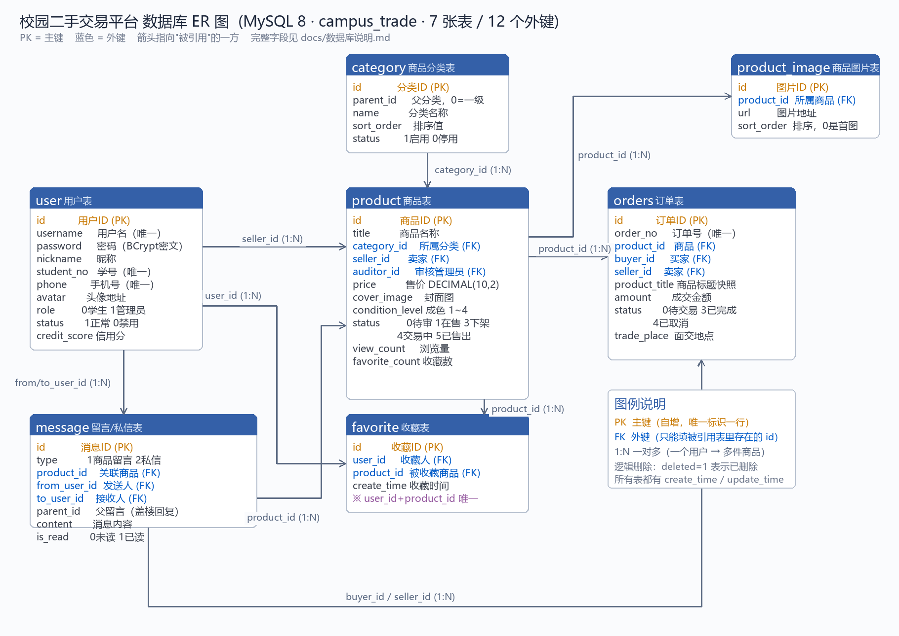

# 校园二手交易平台 · 数据库说明书

> 数据库：`campus_trade`（MySQL 8.4.4）　|　共 **10 张表**、**133 个字段**、**16 个外键**
> 本文档的字段表由 `information_schema` 自动导出（`python docs/gen-db-doc.py` 可重新生成），与数据库真实结构完全一致。

---

## 一、先分清"结构"和"数据"

在 HeidiSQL 里你会看到两个东西，它们不是一回事：

| 你看到的 | 英文 | 是什么 | 类比 Excel |
| --- | --- | --- | --- |
| **「基本」标签页** | Structure / 结构 | 这张表**由哪些列组成**：列名、类型、是否允许为空、默认值、注释、索引、外键 | 表格的**表头**：告诉你有"姓名/学号/电话"这几列 |
| **「数据」标签页** | Data / 数据 | 表里**实际存的一条条记录**（行） | 表格里**一行行的内容**：张三、2021001、138… |

所以「结构」里看到 `id / username / password / nickname …` 是**列定义**（每行一列），
而「数据」里看到的真实账号才是**数据**。建表 SQL 决定结构，注册/发布商品往里写的是数据。

---

## 二、10 张表分别是干什么的

| 表名 | 中文名 | 作用 | 当前行数 |
| --- | --- | --- | ---: |
| `user` | 用户表 | 存放所有账号：普通学生 + 管理员（用 role 区分）。注册、登录、个人资料都读写这张表。 | 4 |
| `category` | 商品分类表 | 商品分类，支持两级（parent_id=0 是一级分类，其余是二级分类）。发布商品时要选一个分类。 | 33 |
| `product` | 商品表 | 二手商品主表。一条记录 = 一件商品，含价格、成色、状态、审核信息、浏览量等。 | 17 |
| `product_image` | 商品图片表 | 一件商品可以有多张图，一张图一行记录（product_id 指向所属商品）。 | 10 |
| `favorite` | 收藏表 | 用户收藏商品的记录，一个用户对一件商品最多一条（有唯一索引）。 | 4 |
| `message` | 留言/私信表 | 站内消息。type=1 是商品留言，type=2 是私信；私信里 from_user_id 发给 to_user_id。 | 9 |
| `orders` | 订单表 | 交易订单。一条记录 = 一次买卖，同时记录买家、卖家、商品快照、金额、订单状态。 | 4 |
| `user_behavior` | 用户行为表（v0.11） | 推荐算法的数据源。浏览/收藏/私信/下单都记一行，同一用户对同一商品的同类行为只保留一行并累加次数。 | 16 |
| `report` | 举报表（v0.13） | 用户举报违规商品或不良用户，管理员在后台处理。target_type 区分举报的是商品还是用户，status 记录处理进度。 | 3 |
| `admin_log` | 管理员操作日志表（v0.13） | 管理端写操作的审计记录：审核商品、强制下架、启用/禁用用户、处理举报，可追溯到「谁在什么时候做了什么」。 | 0 |

---

## 三、表之间的关系（ER 关系）



| 关系 | 说明 |
| --- | --- |
| `product.seller_id` → `user.id` | 一件商品属于一个卖家（1 个用户能发多件商品，1:N） |
| `product.category_id` → `category.id` | 一件商品属于一个分类（1 个分类下有多个商品，1:N） |
| `product.auditor_id` → `user.id` | 商品被哪个管理员审核过 |
| `product_image.product_id` → `product.id` | 一张图片属于一件商品 |
| `favorite.user_id` / `favorite.product_id` | 收藏是"用户 ↔ 商品"的多对多关系，用这张中间表承载 |
| `message.from_user_id` / `to_user_id` → `user.id` | 私信的发送人、接收人 |
| `message.product_id` → `product.id` | 这条私信/留言是关于哪件商品的（可以不填） |
| `orders.product_id` → `product.id` | 这笔订单买的是哪件商品 |
| `orders.buyer_id` / `seller_id` → `user.id` | 订单的买家与卖家（同一张 user 表两个角色） |
| `user_behavior.user_id` / `product_id` | 行为记录挂在用户与商品上，是推荐算法的"用户-物品"交互矩阵来源 |

> 一句话概括：**user 是中心**，商品由 user 发布、归属 category，图片/收藏/消息/订单/行为都挂在 product 或 user 上。

---

## 四、每张表的字段含义

### 4.1 `user`（用户表）

| 字段 | 类型 | 允许空 | 默认值 | 键 | 含义 |
| --- | --- | :---: | --- | :---: | --- |
| `id` | bigint unsigned | 否 | - | 🔑主键 | 用户ID，主键 |
| `username` | varchar(50) | 否 | - | 唯一 | 登录用户名，唯一 |
| `password` | varchar(100) | 否 | - |  | 登录密码，BCrypt 密文 |
| `nickname` | varchar(50) | 是 | - |  | 昵称，展示用 |
| `real_name` | varchar(50) | 是 | - |  | 真实姓名，校内认证用 |
| `student_no` | varchar(30) | 是 | - | 唯一 | 学号，唯一，注册后不可修改 |
| `phone` | varchar(20) | 是 | - | 唯一 | 手机号，唯一 |
| `email` | varchar(100) | 是 | - |  | 邮箱 |
| `avatar` | varchar(255) | 是 | - |  | 头像地址 |
| `gender` | tinyint | 否 | 0 |  | 性别：0未知 1男 2女 |
| `school` | varchar(100) | 是 | - |  | 学校名称 |
| `campus` | varchar(100) | 是 | - |  | 所在校区 |
| `role` | tinyint | 否 | 0 | 索引 | 角色：0普通学生 1管理员 |
| `status` | tinyint | 否 | 1 |  | 账号状态：1正常 0禁用 |
| `credit_score` | int | 否 | 100 |  | 信用分，初始100，交易完成累加 |
| `last_login_time` | datetime | 是 | - |  | 最后登录时间 |
| `create_time` | datetime | 否 | CURRENT_TIMESTAMP |  | 创建时间 |
| `update_time` | datetime | 否 | CURRENT_TIMESTAMP |  | 更新时间 |
| `deleted` | tinyint | 否 | 0 |  | 逻辑删除：0未删除 1已删除 |

### 4.2 `category`（商品分类表）

| 字段 | 类型 | 允许空 | 默认值 | 键 | 含义 |
| --- | --- | :---: | --- | :---: | --- |
| `id` | bigint unsigned | 否 | - | 🔑主键 | 分类ID，主键 |
| `parent_id` | bigint unsigned | 否 | 0 | 索引 | 父分类ID，0表示一级分类 |
| `name` | varchar(50) | 否 | - |  | 分类名称 |
| `icon` | varchar(255) | 是 | - |  | 分类图标地址 |
| `sort_order` | int | 否 | 0 | 索引 | 排序值，越小越靠前 |
| `status` | tinyint | 否 | 1 |  | 状态：1启用 0停用 |
| `create_time` | datetime | 否 | CURRENT_TIMESTAMP |  | 创建时间 |
| `update_time` | datetime | 否 | CURRENT_TIMESTAMP |  | 更新时间 |
| `deleted` | tinyint | 否 | 0 |  | 逻辑删除：0未删除 1已删除 |

### 4.3 `product`（商品表）

| 字段 | 类型 | 允许空 | 默认值 | 键 | 含义 |
| --- | --- | :---: | --- | :---: | --- |
| `id` | bigint unsigned | 否 | - | 🔑主键 | 商品ID，主键 |
| `title` | varchar(100) | 否 | - | 索引 | 商品标题 |
| `description` | text | 是 | - |  | 商品描述（成色、入手渠道、瑕疵说明等） |
| `category_id` | bigint unsigned | 否 | - | 外键 | 所属分类ID |
| `seller_id` | bigint unsigned | 否 | - | 外键 | 卖家用户ID |
| `price` | decimal(10,2) | 否 | - |  | 售价（元） |
| `original_price` | decimal(10,2) | 是 | - |  | 原价（元），用于展示折扣 |
| `cover_image` | varchar(255) | 是 | - |  | 封面图地址 |
| `condition_level` | tinyint | 否 | 1 |  | 成色：1全新 2几乎全新 3轻微使用痕迹 4明显使用痕迹 |
| `campus` | varchar(100) | 是 | - |  | 交易校区 |
| `trade_place` | varchar(100) | 是 | - |  | 期望交易地点 |
| `status` | tinyint | 否 | 0 | 索引 | 状态：0待审核 1在售 2审核不通过 3已下架 4交易中 5已售出 |
| `audit_remark` | varchar(255) | 是 | - |  | 审核意见（驳回理由） |
| `auditor_id` | bigint unsigned | 是 | - | 外键 | 审核管理员ID |
| `audit_time` | datetime | 是 | - |  | 审核时间 |
| `view_count` | int | 否 | 0 |  | 浏览量 |
| `favorite_count` | int | 否 | 0 |  | 收藏量 |
| `shelf_time` | datetime | 是 | - |  | 上架时间 |
| `sold_time` | datetime | 是 | - |  | 售出时间 |
| `create_time` | datetime | 否 | CURRENT_TIMESTAMP | 索引 | 创建时间 |
| `update_time` | datetime | 否 | CURRENT_TIMESTAMP |  | 更新时间 |
| `deleted` | tinyint | 否 | 0 |  | 逻辑删除：0未删除 1已删除 |

### 4.4 `product_image`（商品图片表）

| 字段 | 类型 | 允许空 | 默认值 | 键 | 含义 |
| --- | --- | :---: | --- | :---: | --- |
| `id` | bigint unsigned | 否 | - | 🔑主键 | 图片ID，主键 |
| `product_id` | bigint unsigned | 否 | - | 外键 | 商品ID |
| `url` | varchar(255) | 否 | - |  | 图片地址 |
| `sort_order` | int | 否 | 0 |  | 排序值，0为首图 |
| `create_time` | datetime | 否 | CURRENT_TIMESTAMP |  | 创建时间 |
| `update_time` | datetime | 否 | CURRENT_TIMESTAMP |  | 更新时间 |
| `deleted` | tinyint | 否 | 0 |  | 逻辑删除：0未删除 1已删除 |

### 4.5 `favorite`（收藏表）

| 字段 | 类型 | 允许空 | 默认值 | 键 | 含义 |
| --- | --- | :---: | --- | :---: | --- |
| `id` | bigint unsigned | 否 | - | 🔑主键 | 收藏ID，主键 |
| `user_id` | bigint unsigned | 否 | - | 外键 | 收藏人用户ID |
| `product_id` | bigint unsigned | 否 | - | 外键 | 被收藏商品ID |
| `create_time` | datetime | 否 | CURRENT_TIMESTAMP |  | 创建时间 |
| `update_time` | datetime | 否 | CURRENT_TIMESTAMP |  | 更新时间 |
| `deleted` | tinyint | 否 | 0 |  | 逻辑删除：0未删除 1已删除 |

### 4.6 `message`（留言/私信表）

| 字段 | 类型 | 允许空 | 默认值 | 键 | 含义 |
| --- | --- | :---: | --- | :---: | --- |
| `id` | bigint unsigned | 否 | - | 🔑主键 | 消息ID，主键 |
| `type` | tinyint | 否 | 1 |  | 消息类型：1商品留言 2私信 |
| `product_id` | bigint unsigned | 是 | - | 外键 | 关联商品ID，纯私信可为空 |
| `from_user_id` | bigint unsigned | 否 | - | 外键 | 发送人用户ID |
| `to_user_id` | bigint unsigned | 是 | - | 外键 | 接收人用户ID，商品留言可为空 |
| `parent_id` | bigint unsigned | 否 | 0 |  | 父留言ID，0为顶层留言 |
| `content` | varchar(1000) | 否 | - |  | 消息内容 |
| `is_read` | tinyint | 否 | 0 |  | 是否已读：0未读 1已读 |
| `read_time` | datetime | 是 | - |  | 读取时间 |
| `create_time` | datetime | 否 | CURRENT_TIMESTAMP |  | 创建时间 |
| `update_time` | datetime | 否 | CURRENT_TIMESTAMP |  | 更新时间 |
| `deleted` | tinyint | 否 | 0 |  | 逻辑删除：0未删除 1已删除 |

### 4.7 `orders`（订单表）

| 字段 | 类型 | 允许空 | 默认值 | 键 | 含义 |
| --- | --- | :---: | --- | :---: | --- |
| `id` | bigint unsigned | 否 | - | 🔑主键 | 订单ID，主键 |
| `order_no` | varchar(32) | 否 | - | 唯一 | 订单编号，对外展示，唯一 |
| `product_id` | bigint unsigned | 否 | - | 外键 | 商品ID |
| `buyer_id` | bigint unsigned | 否 | - | 外键 | 买家用户ID |
| `seller_id` | bigint unsigned | 否 | - | 外键 | 卖家用户ID |
| `product_title` | varchar(100) | 否 | - |  | 商品标题快照 |
| `product_image` | varchar(255) | 是 | - |  | 商品封面快照 |
| `amount` | decimal(10,2) | 否 | - |  | 成交金额（元） |
| `status` | tinyint | 否 | 0 |  | 状态：0待付款 1待交付 2待收货 3已完成 4已取消 5已退款 |
| `delivery_type` | tinyint | 否 | 1 |  | 交付方式：1校内面交 2快递 |
| `trade_place` | varchar(100) | 是 | - |  | 面交地点 |
| `receiver_name` | varchar(50) | 是 | - |  | 收货人姓名（快递时必填） |
| `receiver_phone` | varchar(20) | 是 | - |  | 收货人电话 |
| `receiver_address` | varchar(255) | 是 | - |  | 收货地址 |
| `pay_type` | tinyint | 是 | - |  | 支付方式：1模拟支付 2微信 3支付宝 |
| `pay_time` | datetime | 是 | - |  | 支付时间 |
| `deliver_time` | datetime | 是 | - |  | 卖家交付时间 |
| `finish_time` | datetime | 是 | - |  | 交易完成时间 |
| `cancel_time` | datetime | 是 | - |  | 取消时间 |
| `cancel_reason` | varchar(255) | 是 | - |  | 取消/退款原因 |
| `buyer_remark` | varchar(255) | 是 | - |  | 买家备注 |
| `create_time` | datetime | 否 | CURRENT_TIMESTAMP | 索引 | 创建时间 |
| `update_time` | datetime | 否 | CURRENT_TIMESTAMP |  | 更新时间 |
| `deleted` | tinyint | 否 | 0 |  | 逻辑删除：0未删除 1已删除 |

### 4.8 `user_behavior`（用户行为表（v0.11））

| 字段 | 类型 | 允许空 | 默认值 | 键 | 含义 |
| --- | --- | :---: | --- | :---: | --- |
| `id` | bigint unsigned | 否 | - | 🔑主键 | 行为ID，主键 |
| `user_id` | bigint unsigned | 否 | - | 外键 | 用户ID（外键 -> user.id） |
| `product_id` | bigint unsigned | 否 | - | 外键 | 商品ID（外键 -> product.id） |
| `behavior_type` | tinyint | 否 | - | 索引 | 行为类型：1浏览 2收藏 3私信 4下单 |
| `category_id` | bigint unsigned | 是 | - |  | 冗余的商品分类ID，便于聚合用户偏好 |
| `weight` | decimal(4,2) | 否 | 1.00 |  | 行为权重（兴趣强度，1~5） |
| `behavior_count` | int | 否 | 1 |  | 同类行为累计发生次数 |
| `create_time` | datetime | 否 | CURRENT_TIMESTAMP |  | 首次发生时间 |
| `update_time` | datetime | 否 | CURRENT_TIMESTAMP |  | 最近发生时间 |
| `deleted` | tinyint | 否 | 0 |  | 逻辑删除：0未删除 1已删除 |

### 4.9 `report`（举报表（v0.13））

| 字段 | 类型 | 允许空 | 默认值 | 键 | 含义 |
| --- | --- | :---: | --- | :---: | --- |
| `id` | bigint unsigned | 否 | - | 🔑主键 | 举报ID，主键 |
| `reporter_id` | bigint unsigned | 否 | - | 外键 | 举报人ID（外键 -> user.id） |
| `target_type` | tinyint | 否 | 1 | 索引 | 举报对象类型：1商品 2用户 |
| `target_id` | bigint unsigned | 否 | - |  | 举报对象ID（商品ID或用户ID） |
| `reason_type` | tinyint | 否 | 4 |  | 举报原因：1虚假信息 2违禁物品 3辱骂骚扰 4其他 |
| `content` | varchar(500) | 是 | - |  | 补充说明 |
| `image_url` | varchar(255) | 是 | - |  | 证据图片地址 |
| `status` | tinyint | 否 | 0 | 索引 | 处理状态：0待处理 1已处理 2已忽略 |
| `handle_admin_id` | bigint unsigned | 是 | - |  | 处理人（管理员ID） |
| `handle_result` | varchar(255) | 是 | - |  | 处理结果说明 |
| `handle_time` | datetime | 是 | - |  | 处理时间 |
| `create_time` | datetime | 否 | CURRENT_TIMESTAMP |  | 举报时间 |
| `update_time` | datetime | 否 | CURRENT_TIMESTAMP |  | 更新时间 |
| `deleted` | tinyint | 否 | 0 |  | 逻辑删除：0未删除 1已删除 |

### 4.10 `admin_log`（管理员操作日志表（v0.13））

| 字段 | 类型 | 允许空 | 默认值 | 键 | 含义 |
| --- | --- | :---: | --- | :---: | --- |
| `id` | bigint unsigned | 否 | - | 🔑主键 | 日志ID，主键 |
| `admin_id` | bigint unsigned | 否 | - | 外键 | 操作管理员ID（外键 -> user.id） |
| `admin_name` | varchar(50) | 是 | - |  | 管理员用户名（冗余，便于查日志） |
| `action` | varchar(50) | 否 | - | 索引 | 操作类型：AUDIT_PRODUCT / DISABLE_USER / HANDLE_REPORT ... |
| `target_type` | varchar(20) | 是 | - |  | 对象类型：PRODUCT / USER / REPORT |
| `target_id` | bigint unsigned | 是 | - |  | 对象ID |
| `detail` | varchar(500) | 是 | - |  | 操作详情（如"驳回：图片含违禁内容"） |
| `ip` | varchar(64) | 是 | - |  | 操作人IP |
| `create_time` | datetime | 否 | CURRENT_TIMESTAMP |  | 操作时间 |
| `deleted` | tinyint | 否 | 0 |  | 逻辑删除：0未删除 1已删除 |

---

## 五、状态/类型字段对照表（重点）

| 表.字段 | 取值 | 含义 |
| --- | --- | --- |
| `user.role` | 0 / 1 | 0 = 普通学生，1 = 管理员 |
| `user.status` | 1 / 0 | 1 = 正常，0 = 禁用（禁用后不能登录） |
| `user.gender` | 0 / 1 / 2 | 0 = 保密，1 = 男，2 = 女 |
| `product.status` | 0 / 1 / 2 / 3 / 4 / 5 | 0 = 待审核，1 = 在售，2 = 审核不通过，3 = 已下架，4 = 交易中，5 = 已售出 |
| `product.condition_level` | 1 / 2 / 3 / 4 | 成色：1 = 全新，2 = 几乎全新，3 = 轻微使用痕迹，4 = 明显使用痕迹 |
| `orders.status` | 0 / 3 / 4 | 0 = 待交易，3 = 已完成，4 = 已取消（1/2/5 为预留：待交付/待收货/已退款） |
| `message.type` | 1 / 2 | 1 = 商品留言，2 = 私信 |
| `message.is_read` | 0 / 1 | 0 = 未读，1 = 已读 |
| `category.parent_id` | 0 / 其他 | 0 = 一级分类；其他值 = 它的父分类 id（二级分类） |
| `user_behavior.behavior_type` | 1 / 2 / 3 / 4 | 1 = 浏览（权重 1），2 = 收藏（权重 3），3 = 私信（权重 2），4 = 下单（权重 5） |
| `report.target_type` | 1 / 2 | 1 = 举报商品，2 = 举报用户 |
| `report.reason_type` | 1 / 2 / 3 / 4 | 1 = 虚假信息，2 = 违禁物品，3 = 辱骂骚扰，4 = 其他 |
| `report.status` | 0 / 1 / 2 | 0 = 待处理，1 = 已处理，2 = 已忽略 |
| 所有表 `deleted` | 0 / 1 | 0 = 未删除，1 = 已逻辑删除（**逻辑删除**：数据还在，只是查询时自动过滤掉） |

---

## 六、几个"看起来奇怪"的地方，其实都是设计

| 现象 | 原因 |
| --- | --- |
| `password` 是 `$2a$10$...` 60 位乱码 | 用 **BCrypt 单向加密**存的，不可逆。登录时是把用户输入的密码再加密后比对，所以数据库里永远没有明文 |
| `id` 是 1、5、6、7… 不连续 | 自增主键。中间被删的记录 id 不会回收（正常现象） |
| `create_time` / `update_time` 会自动变 | 建表时设了 `DEFAULT CURRENT_TIMESTAMP` 和 `ON UPDATE CURRENT_TIMESTAMP`，插入/修改时数据库自动填 |
| `price` 用 `DECIMAL(10,2)` | 金额**不能用 FLOAT/DOUBLE**（会有精度误差），DECIMAL 精确到分 |
| 表名叫 `orders` 而不是 `order` | `order` 是 MySQL 保留字（`ORDER BY`），直接当表名会报错 |
| 成色字段叫 `condition_level` | `condition` 同样是 MySQL 保留字 |
| `product.favorite_count` 是冗余计数 | 收藏表里已经有明细，但列表页要频繁显示"多少人收藏"，冗余一个计数避免每次 COUNT；**应用在收藏/取消时同步维护**（v0.10 已修复并发下的计数与错误码问题） |
| `user_behavior` 同一用户同一商品只有一行 | 唯一索引 `uk_user_product_type`：避免"浏览"把表撑爆，用 `behavior_count` 记频次、`update_time` 记最近时间 |
| 外键（Foreign Key）的含义 | 比如 `orders.product_id` 只能填 `product` 表里真实存在的 id；填不存在的值数据库直接报 1452，保证数据不会"指错" |

---

## 七、想看数据时，直接跑这几条 SQL

```sql
USE campus_trade;

SELECT * FROM `user`;                     -- 所有账号
SELECT * FROM product WHERE status = 1;   -- 在售商品
SELECT * FROM orders;                    -- 订单
SELECT * FROM favorite;                  -- 收藏
SELECT * FROM message WHERE type = 2;    -- 私信
SELECT * FROM user_behavior ORDER BY update_time DESC LIMIT 20;  -- 最近行为（推荐数据源）
```

更多现成查询见 [常用查询.sql](./常用查询.sql)。

---

## 八、一张表怎么"读"（以 user 为例）

在 HeidiSQL 里双击 `user` 打开数据后，你可以这样读一行：

```
id=6  username=serendipity  nickname=薇尔莉特  password=$2a$10$e2C…（密文）
role=0（普通学生）  status=1（正常）  credit_score=100  create_time=2026-10-02 19:36:45
```

翻译成业务语言：**"2026-10-02 19:36:45 注册了一个普通学生账号，用户名 serendipity、昵称薇尔莉特，密码经过 BCrypt 加密存储，当前状态正常、信用分 100 分。"**

> 这就是"数据"：一条记录 = 现实里的一个对象（一个用户、一件商品、一笔订单、一次行为）。
> 而"结构"回答的是"这个对象有哪些属性、每个属性什么类型、能不能为空"。

---

相关文档：[需求与设计](../spec.md) · [接口文档](./api.md) · [建表脚本](../db_schema.sql) · [推荐算法说明](./推荐算法说明.md) · [测试用例](./test-cases.md)