# 测试报告 · 用户故事视角（AI 驱动真实浏览器）

> 校园二手交易平台 · 黎钟 · 2027 届软件工程

> 本报告由 `tools/story-browser-report.py` **自动生成**：脚本用 Playwright 驱动**真实浏览器（系统 Edge）**，按 `docs/user-stories.md` 中的用户故事逐条操作，每一步自动截图，最后汇总为本报告。

## 一、执行概要

| 项 | 值 |
| --- | --- |
| 执行时间 | 2026-10-09 12:08:25 ~ 12:09:12 |
| 浏览器 | Microsoft Edge（Chromium 内核，Playwright 驱动，无头模式） |
| 视口 | 1440 × 900（含一项 390 × 844 窄屏场景） |
| 被测地址 | http://127.0.0.1:8081（Nginx 部署形态） |
| 覆盖用户故事 | 9 条 |
| 通过 | **9 / 9** |
| 页面 JS 错误合计 | **0** |
| 截图证据 | `docs/story-evidence/`（共 16 张） |

## 二、结果总览

| 用户故事 | 验收标准 | 结论 | 页面 JS 错误 |
| --- | --- | --- | --- |
| **US-USER-02** 登录与登录态保持 | AC1 登录成功 / AC3 未登录被路由守卫拦截 | ✅ 通过 | 0 |
| **US-USER-01** 注册账号（表单校验） | AC3 必填项为空时前端拦截 | ✅ 通过 | 0 |
| **US-GOODS-01** 发布商品（表单校验） | AC2 空值拦截 / AC3 非法价格拦截 | ✅ 通过 | 0 |
| **US-SEARCH-01** 关键词搜索商品 | AC1 搜到结果 / AC2 无结果显示空状态 | ✅ 通过 | 0 |
| **US-GOODS-04** 商品详情可见性与异常态 | AC2 不可见商品不泄漏 / 异常时有明确反馈 | ✅ 通过 | 0 |
| **US-QUALITY-01** 权限与越权防护 | AC2 普通用户访问管理后台被拦截 | ✅ 通过 | 0 |
| **US-QUALITY-05** 窄屏可用（390px） | AC1 无横向溢出 | ✅ 通过 | 0 |
| **US-CHAT-03** 会话列表页面可用 | AC1 页面正常渲染 | ✅ 通过 | 0 |
| **US-ORDER-02** 买卖双方订单视图 | AC1/AC2 两个视图均可正常打开 | ✅ 通过 | 0 |

> 说明：本报告聚焦"**只读与表单校验**"类场景（不写入真实数据）。涉及注册、发布、审核、下单、私信、订单流转等**写操作**的完整闭环，由 `tests/e2e/` 下的三套自动化测试（端到端 31 条、部署验证 28 条、单元测试 76 条）覆盖，详见 [v0.16 测试报告](test-report-v0.16.md)。

## 三、逐条用户故事明细

### US-USER-02　登录与登录态保持

**对应验收标准**：AC1 登录成功 / AC3 未登录被路由守卫拦截　　**结论**：✅ 通过

**执行记录**

- AC1 登录成功，落地页：http://127.0.0.1:8081/home
- AC（登录态）访问受保护页面 /product/publish：可正常进入 ✓
- AC3 未登录访问 /product/publish → 最终地址：http://127.0.0.1:8081/login?redirect=/product/publish（已跳转登录页 ✓）

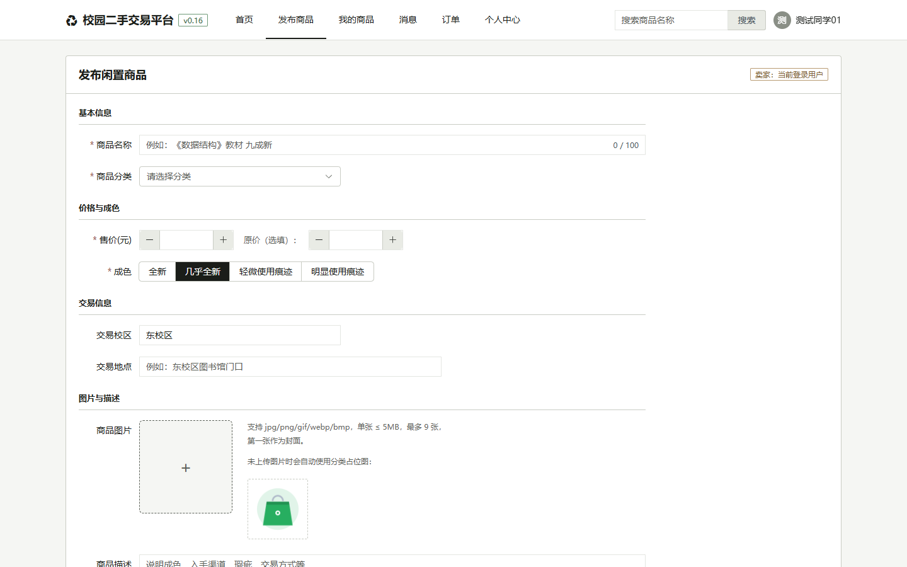

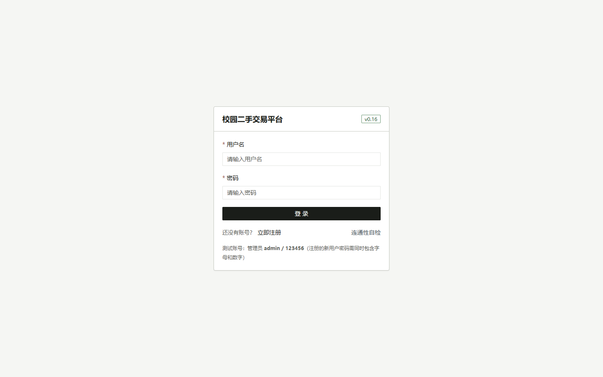

### US-USER-01　注册账号（表单校验）

**对应验收标准**：AC3 必填项为空时前端拦截　　**结论**：✅ 通过

**执行记录**

- AC3 空表单提交后：处于校验失败状态的字段 4 个（红框标记），可见错误文案 0 条

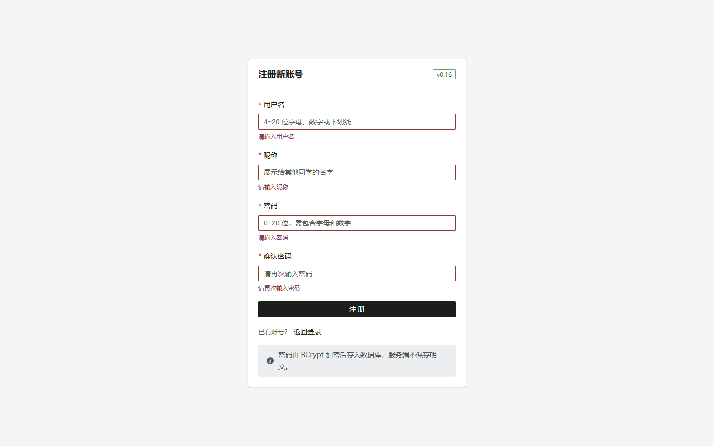

### US-GOODS-01　发布商品（表单校验）

**对应验收标准**：AC2 空值拦截 / AC3 非法价格拦截　　**结论**：✅ 通过

**执行记录**

- AC2 空表单提交 → 提示 ['请输入商品名称', '请选择商品分类', '请输入售价']（期望包含 ['请输入售价', '请输入商品名称', '请选择商品分类']）
- AC3 售价输入 25.555 → 组件归一化为 25.56（el-input-number :precision=2 第一层防护）
- AC3 售价输入 0 → 被 :min 夹到 0.01（第二层由规则模块给出提示）

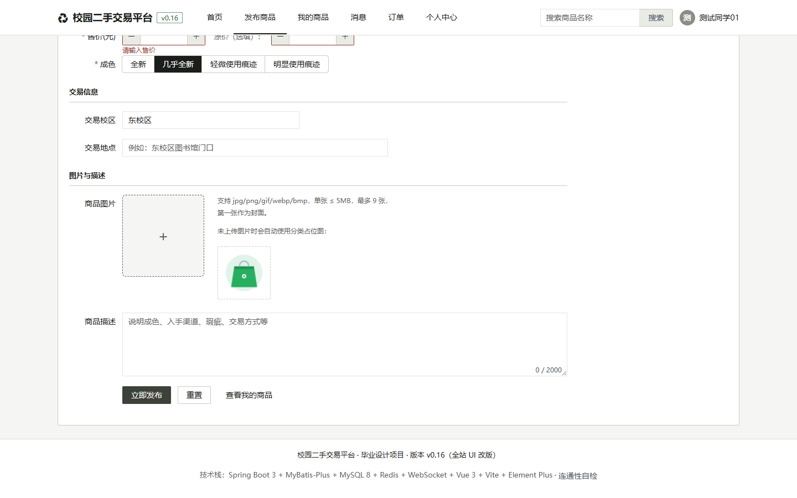

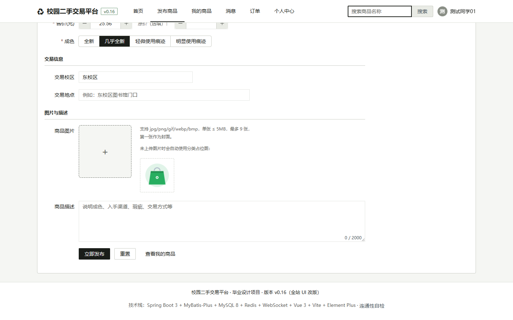

### US-SEARCH-01　关键词搜索商品

**对应验收标准**：AC1 搜到结果 / AC2 无结果显示空状态　　**结论**：✅ 通过

**执行记录**

- 访问 /search?keyword=教材 → URL 保持：http://127.0.0.1:8081/search?keyword=%E6%95%99%E6%9D%90
- 页面包含搜索结果或空状态文案：是 ✓
- AC2 搜索无结果 → 显示空状态：是 ✓

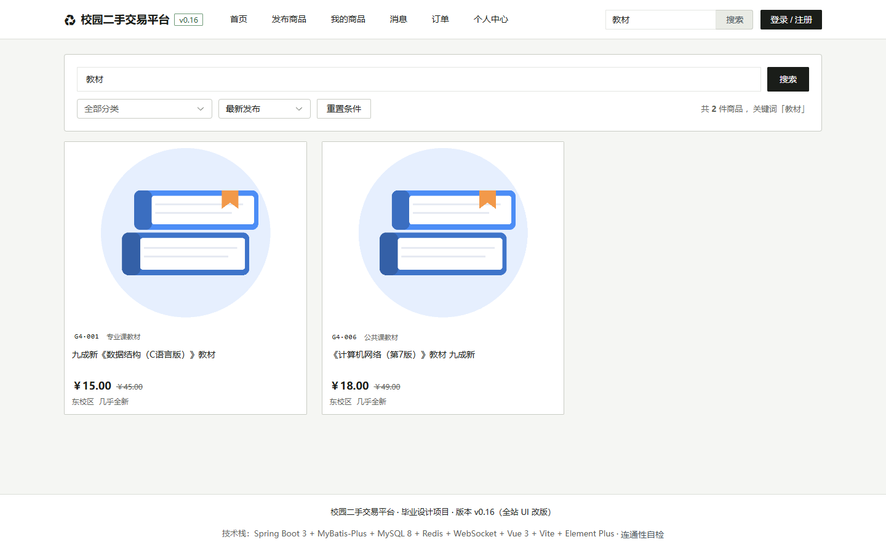

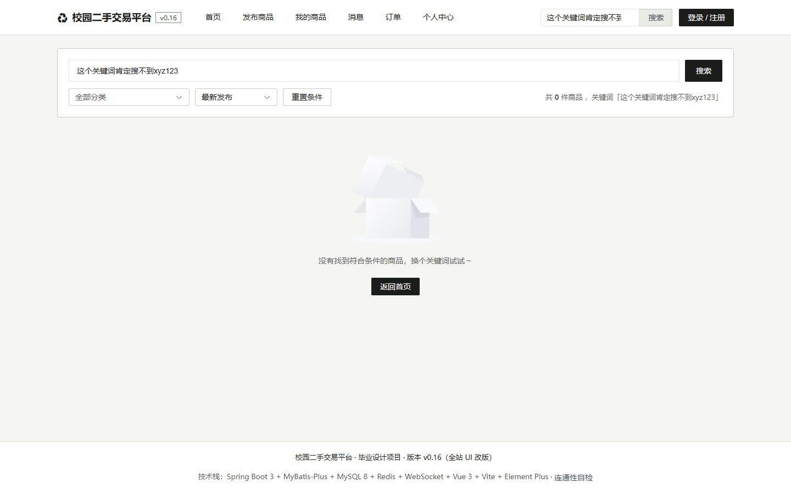

### US-GOODS-04　商品详情可见性与异常态

**对应验收标准**：AC2 不可见商品不泄漏 / 异常时有明确反馈　　**结论**：✅ 通过

**执行记录**

- AC（异常场景）访问不存在的商品 id → 页面不白屏，有以下反馈：不存在、失败

### US-QUALITY-01　权限与越权防护

**对应验收标准**：AC2 普通用户访问管理后台被拦截　　**结论**：✅ 通过

**执行记录**

- AC2 普通用户访问 /admin/dashboard → 实际渲染：首页（已按守卫重定向 ✓）；地址栏读数为 http://127.0.0.1:8081/home
- AC（对照）管理员访问 /admin/dashboard → 实际渲染：后台数据看板 ✓

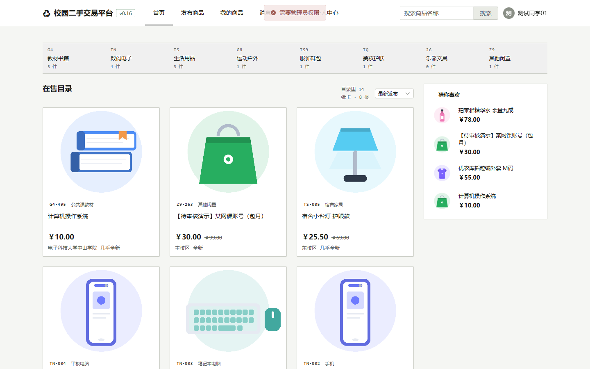

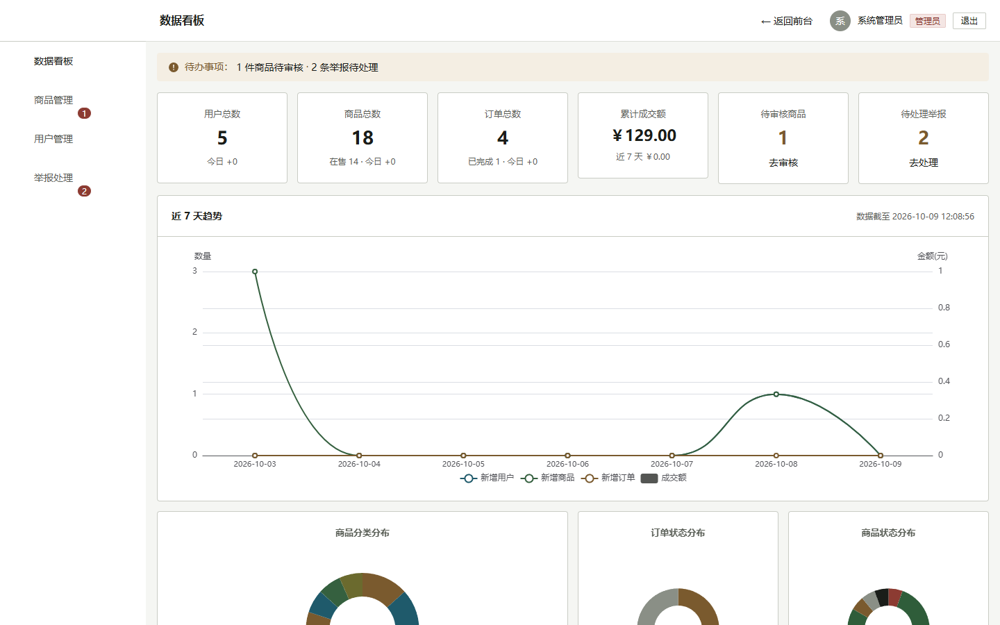

### US-QUALITY-05　窄屏可用（390px）

**对应验收标准**：AC1 无横向溢出　　**结论**：✅ 通过

**执行记录**

- 视口 390px 下 documentElement.scrollWidth=390、innerWidth=390，横向溢出 0px（达标 ✓）

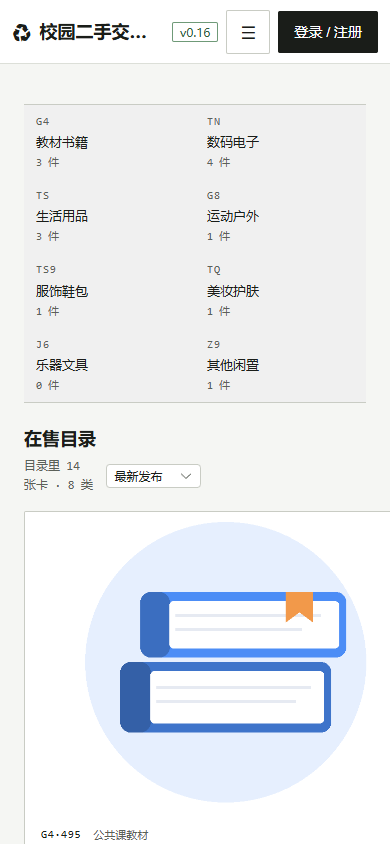

### US-CHAT-03　会话列表页面可用

**对应验收标准**：AC1 页面正常渲染　　**结论**：✅ 通过

**执行记录**

- 访问 /messages → 页面渲染正常（含会话或空状态）

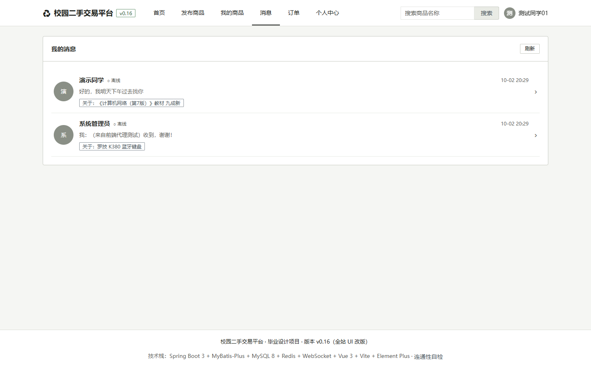

### US-ORDER-02　买卖双方订单视图

**对应验收标准**：AC1/AC2 两个视图均可正常打开　　**结论**：✅ 通过

**执行记录**

- 访问 /orders/bought（我买到的）→ 渲染正常 ✓
- 访问 /orders/sold（我卖出的）→ 渲染正常 ✓

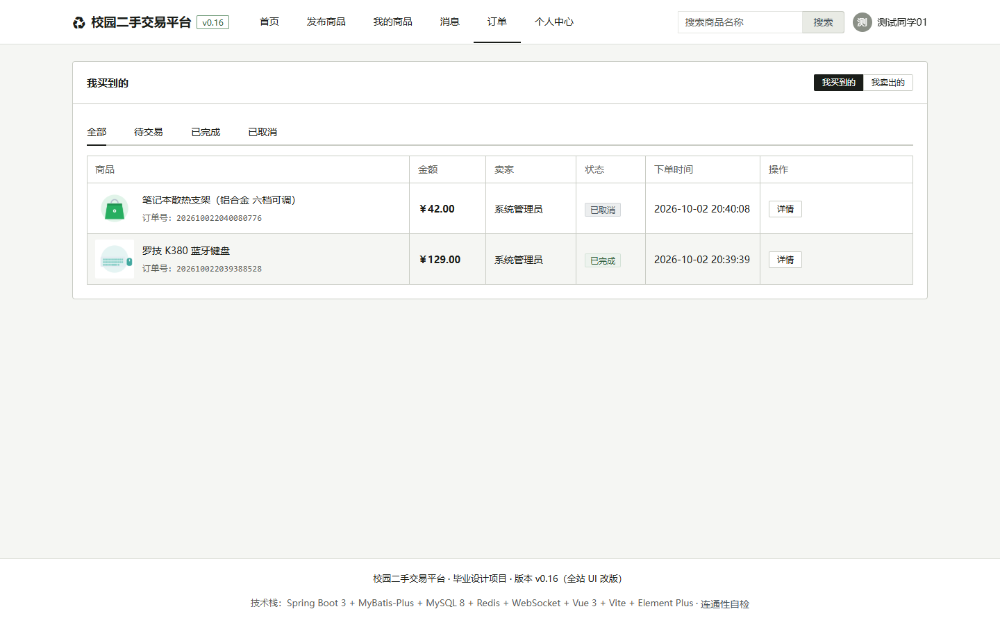

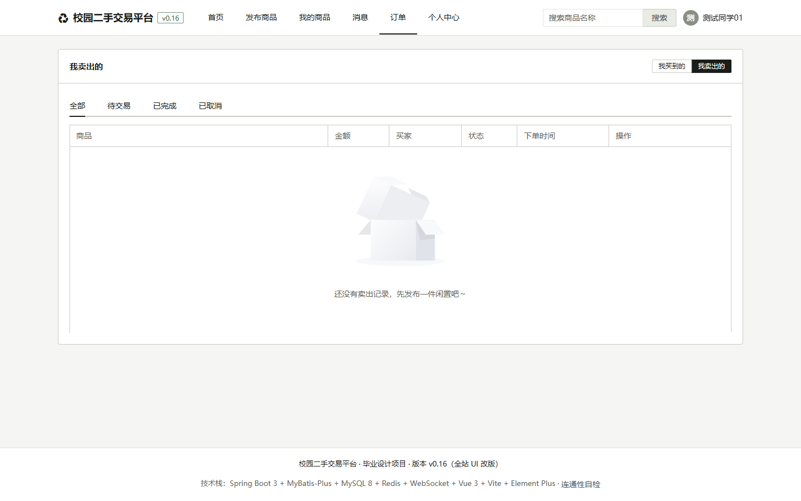

---

*报告由脚本自动生成于 2026-10-09 12:09:12；重新生成命令：`python tools/story-browser-report.py`。*