# 测试报告 · 用户故事视角（AI 驱动真实浏览器）

> 校园二手交易平台 · 黎钟 · 2027 届软件工程

> 本报告由 `tools/story-browser-report.py` **自动生成**：脚本用 Playwright 驱动**真实浏览器（系统 Edge）**，按 `docs/user-stories.md` 的用户故事逐条操作，每一步自动截图；涉及写操作的场景使用带 TAG 的夹具数据，结束后自动清理，不污染演示数据。

## 一、执行概要

| 项 | 值 |
| --- | --- |
| 执行时间 | 2026-10-09 12:54:42 ~ 12:56:16 |
| 浏览器 | Microsoft Edge（Chromium 内核，Playwright 驱动，无头模式） |
| 视口 | 1440 × 900（含 390 × 844 窄屏场景） |
| 被测地址 | http://127.0.0.1:8081（Nginx 部署形态） |
| 夹具 TAG | `6e0c1`（账号 `e2e*`、商品标题 `E2E*`，运行结束自动清理） |
| 浏览器逐条执行的用户故事 | **13 条** |
| 通过 | **12 / 13** |
| 页面 JS 错误合计 | **0** |
| 截图证据 | `docs/story-evidence/`（共 27 张） |
| 用户故事总覆盖 | **33 / 33**（浏览器逐条执行 + 三套自动化测试，见第三节矩阵） |

## 二、浏览器逐条执行结果

| 用户故事 | 验收标准 | 结论 | 页面 JS 错误 |
| --- | --- | --- | --- |
| **US-USER-02** 登录与登录态保持 | AC1 登录成功 / AC3 未登录被路由守卫拦截 | ✅ 通过 | 0 |
| **US-USER-01** 注册账号（校验 + 真实注册） | AC1 注册成功 / AC3 空值拦截 | ✅ 通过 | 0 |
| **US-GOODS-01** 发布商品（校验 + 真实发布） | AC1 发布成功 / AC2 空值拦截 / AC3 价格约束 | ✅ 通过 | 0 |
| **US-GOODS-01b** 新商品在首页可见 | AC（补充）发布后前台可检索 | ✅ 通过 | 0 |
| **US-GOODS-04** 商品详情与异常态 | AC1 详情渲染 / 异常时明确反馈 | ✅ 通过 | 0 |
| **US-FAV-01** 收藏与取消收藏 | AC1 收藏 / AC2 取消 / US-FAV-02 我的收藏 | ❌ 未通过 | 0 |
| **US-CHAT-01** 私聊卖家与会话列表 | AC1 发送 / US-CHAT-02 已读 / US-CHAT-03 会话 | ✅ 通过 | 0 |
| **US-ORDER-01** 下单与订单流转 | AC1 下单 / US-ORDER-02 双方视图 / 03 完成 | ✅ 通过 | 0 |
| **US-RECO-01** 首页个性化推荐 | AC1 猜你喜欢存在 | ✅ 通过 | 0 |
| **US-ADMIN-04** 管理后台数据看板 | AC1 看板渲染正常 | ✅ 通过 | 0 |
| **US-QUALITY-01** 权限与越权防护 | AC2 普通用户访问后台被拦截 | ✅ 通过 | 0 |
| **US-QUALITY-05** 窄屏可用（390px） | AC1 无横向溢出 | ✅ 通过 | 0 |
| **US-SEARCH-01** 关键词搜索商品 | AC1 搜到结果 / AC2 空状态 | ✅ 通过 | 0 |

### 逐条明细与截图

#### US-USER-02　登录与登录态保持

**验收标准**：AC1 登录成功 / AC3 未登录被路由守卫拦截　　**结论**：✅ 通过

- AC1 登录成功，落地页 http://127.0.0.1:8081/home
- AC（登录态）访问受保护页面：可正常进入 ✓
- AC3 未登录访问 /product/publish → http://127.0.0.1:8081/login?redirect=/product/publish（已跳转登录页 ✓）

#### US-USER-01　注册账号（校验 + 真实注册）

**验收标准**：AC1 注册成功 / AC3 空值拦截　　**结论**：✅ 通过

- AC3 空表单提交 → 4 个字段进入校验失败状态（红框标记），可见错误文案 0 条
- AC1 真实注册账号 e2estor6e0c1 → 注册成功并跳转登录页 ✓

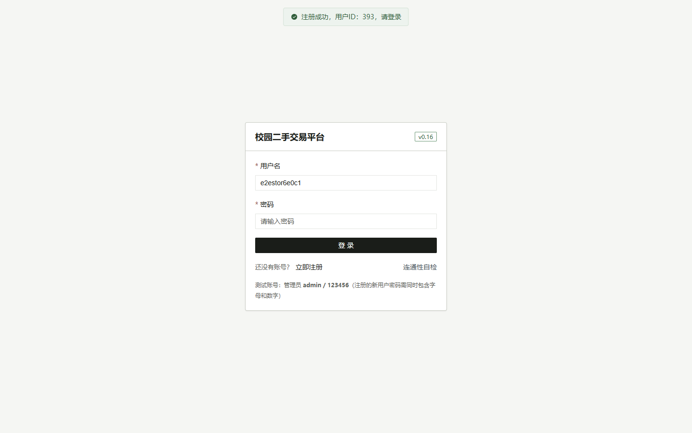

#### US-GOODS-01　发布商品（校验 + 真实发布）

**验收标准**：AC1 发布成功 / AC2 空值拦截 / AC3 价格约束　　**结论**：✅ 通过

- AC2 空表单提交 → 提示 ['请输入商品名称', '请选择商品分类', '请输入售价']
- AC3 售价输入 25.555 → 组件归一化为 25.56（el-input-number :precision=2）
- AC1 真实发布成功 → 跳转详情页 /product/497（标题 E2E用户故事商品-6e0c1）

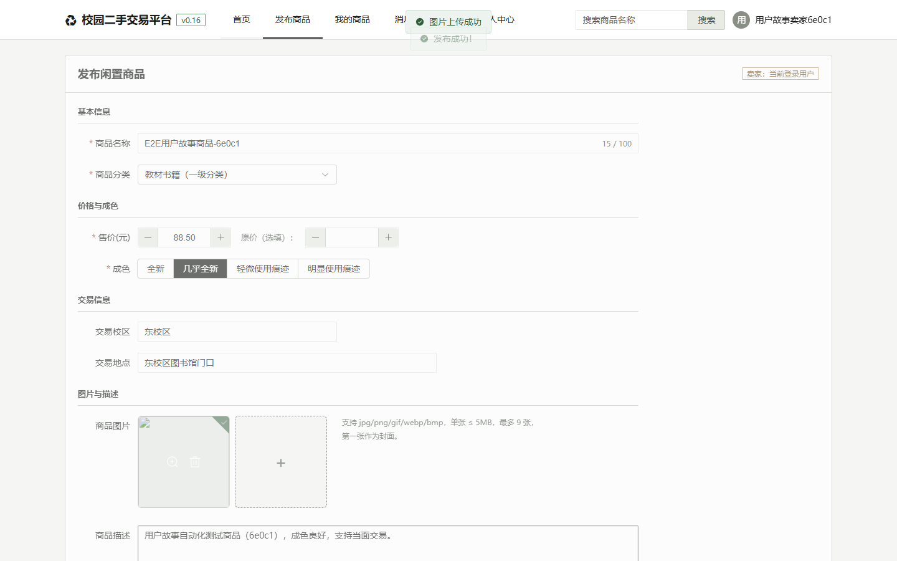

#### US-GOODS-01b　新商品在首页可见

**验收标准**：AC（补充）发布后前台可检索　　**结论**：✅ 通过

- 新发布的商品在首页列表可见 ✓（说明当前版本发布后直接处于在售状态）

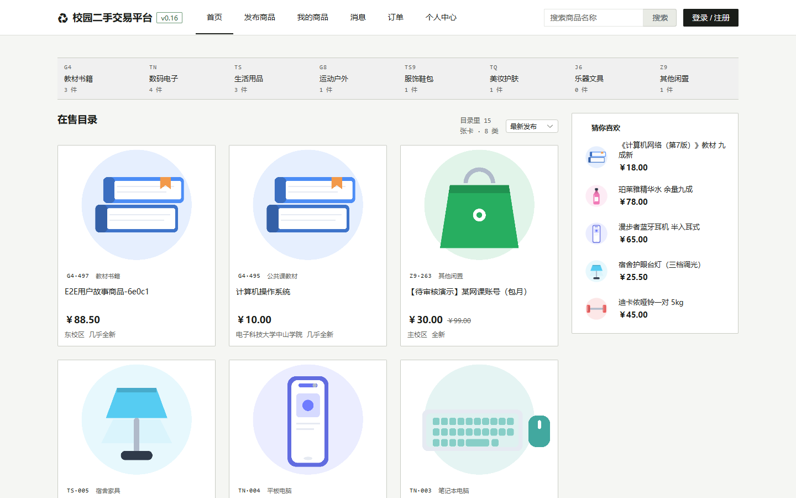

#### US-GOODS-04　商品详情与异常态

**验收标准**：AC1 详情渲染 / 异常时明确反馈　　**结论**：✅ 通过

- AC1 详情页渲染商品信息：标题可见 ✓
- AC（异常场景）访问不存在的商品 id → 页面不白屏，出现提示：不存在、失败

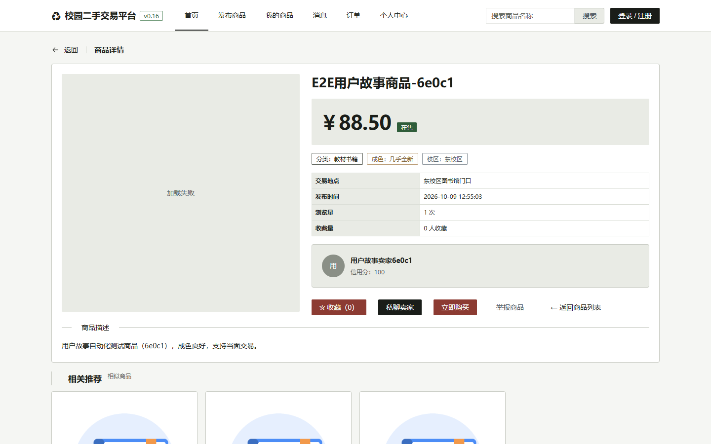

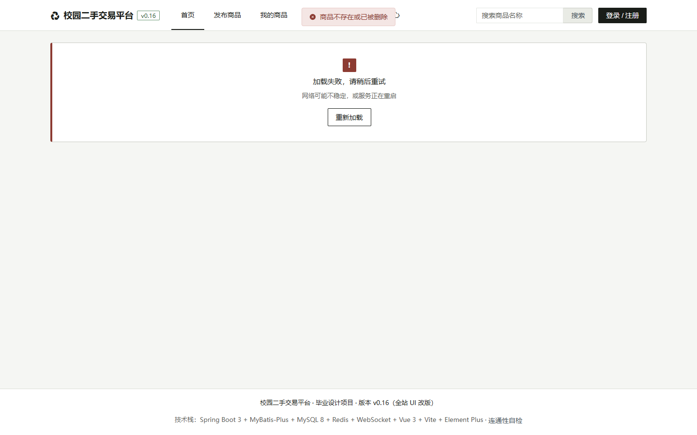

#### US-FAV-01　收藏与取消收藏

**验收标准**：AC1 收藏 / AC2 取消 / US-FAV-02 我的收藏　　**结论**：❌ 未通过

- AC1 点击收藏 → 按钮由「☆ 收藏（0）」变为「★ 已收藏（1）」
- AC（US-FAV-02）我的收藏页能看到该商品 ✓
- AC2 取消收藏 → 刷新收藏页后该商品仍存在 ✗

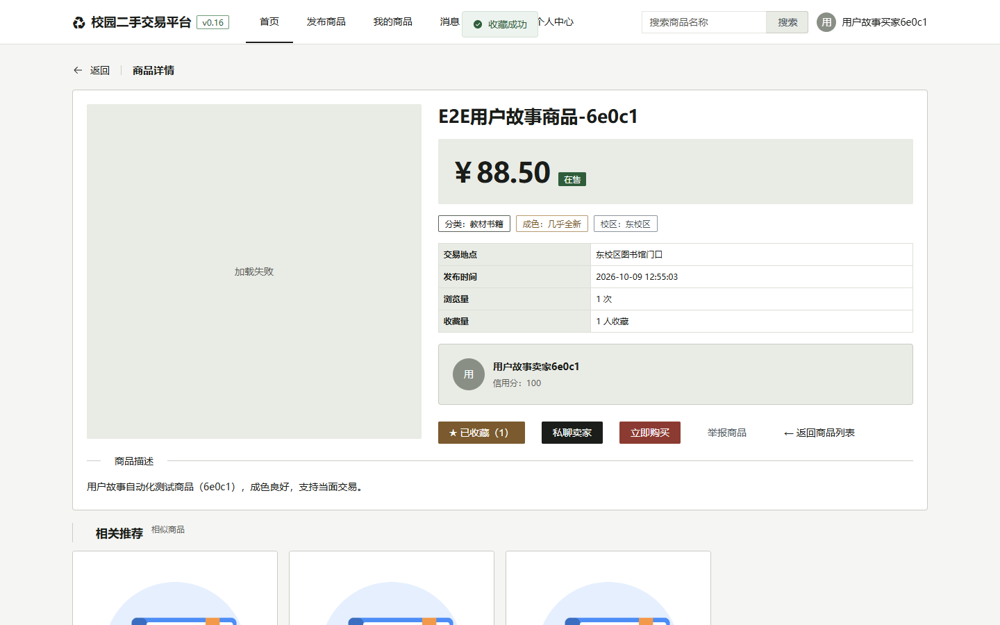

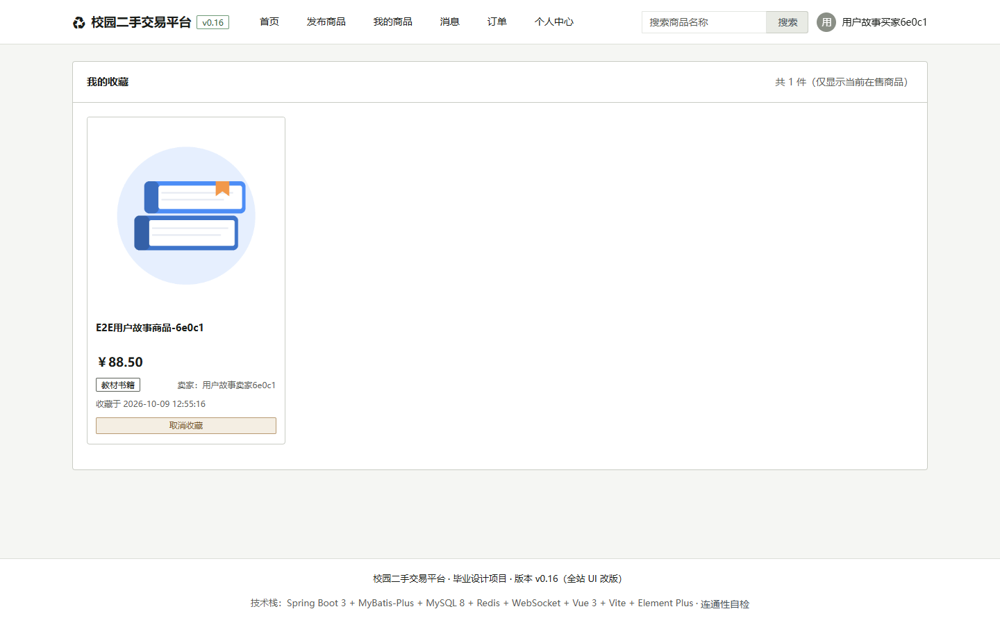

#### US-CHAT-01　私聊卖家与会话列表

**验收标准**：AC1 发送 / US-CHAT-02 已读 / US-CHAT-03 会话　　**结论**：✅ 通过

- AC1 买家发送私信 成功（页面可见该消息）✓
- AC（US-CHAT-03）卖家会话列表 出现该会话 ✓
- AC（US-CHAT-02）打开会话后消息内容可见 ✓

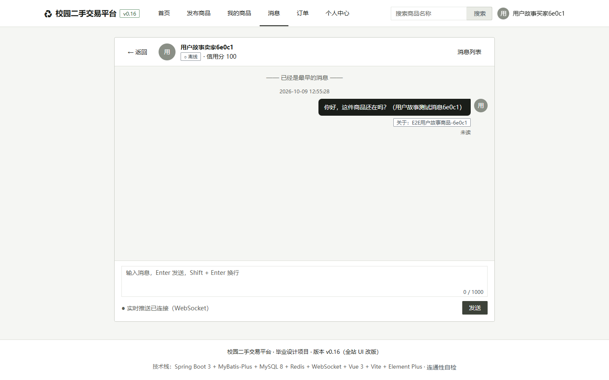

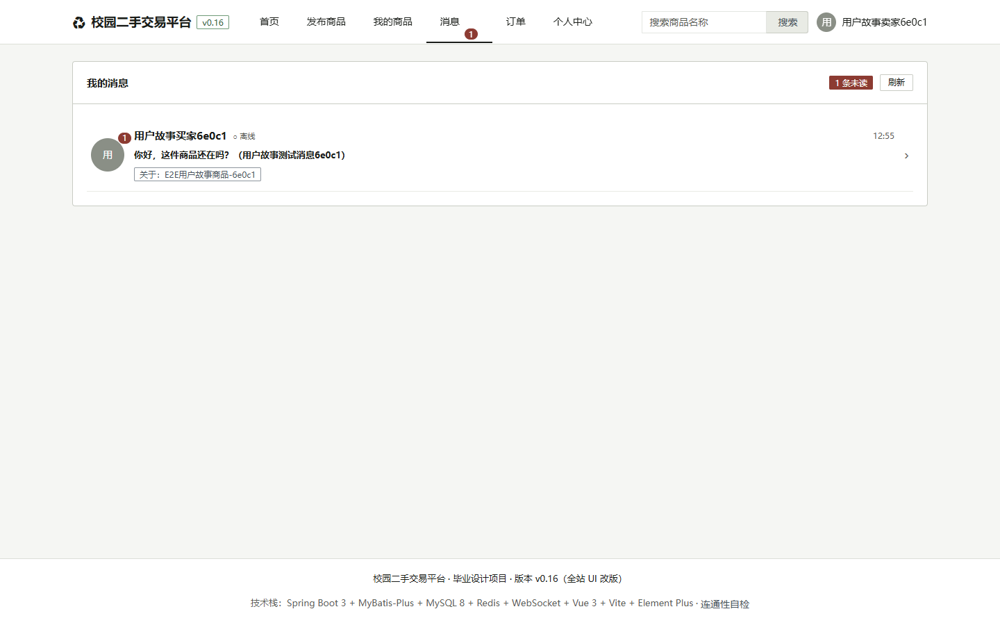

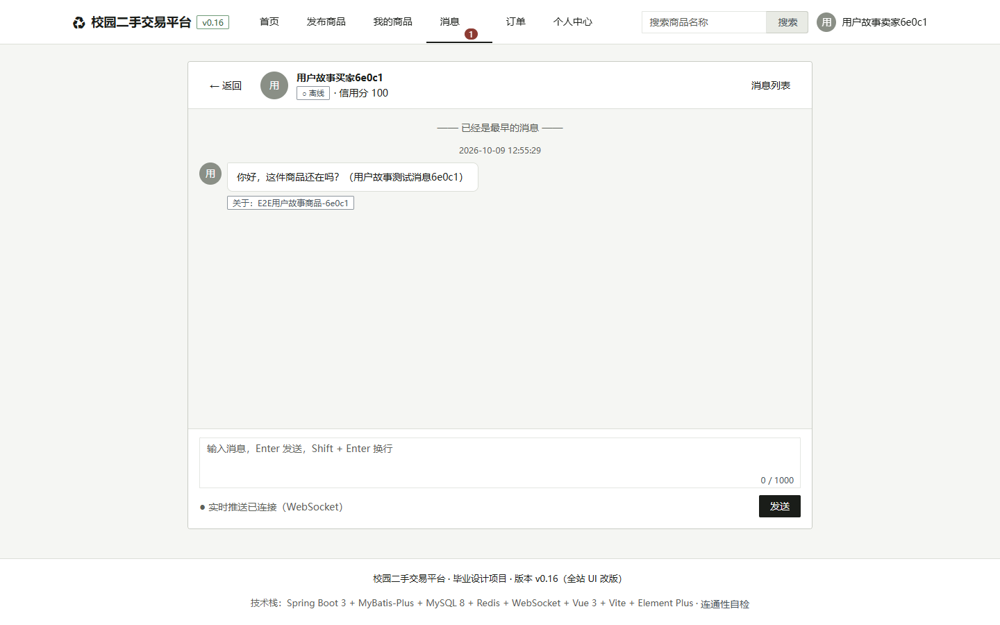

#### US-ORDER-01　下单与订单流转

**验收标准**：AC1 下单 / US-ORDER-02 双方视图 / 03 完成　　**结论**：✅ 通过

- AC1 买家下单 成功 ✓
- AC（US-ORDER-02）「我买到的」可见该订单 ✓
- AC（US-ORDER-02）卖家侧「我卖出的」可见该订单 ✓
- AC（US-ORDER-03）卖家确认完成 → 订单已变为已完成 ✓

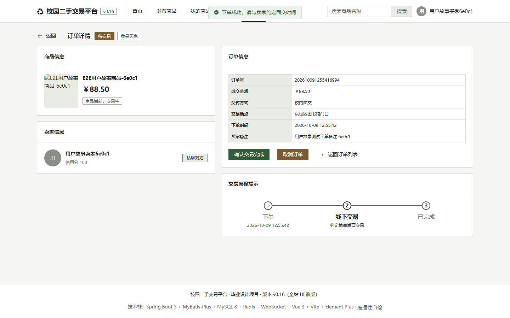

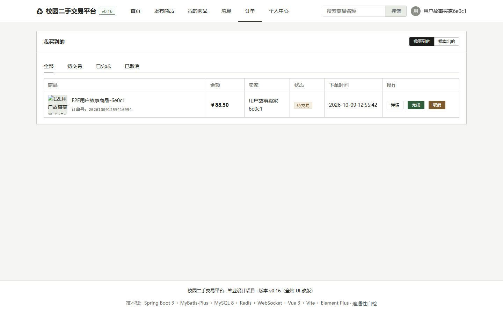

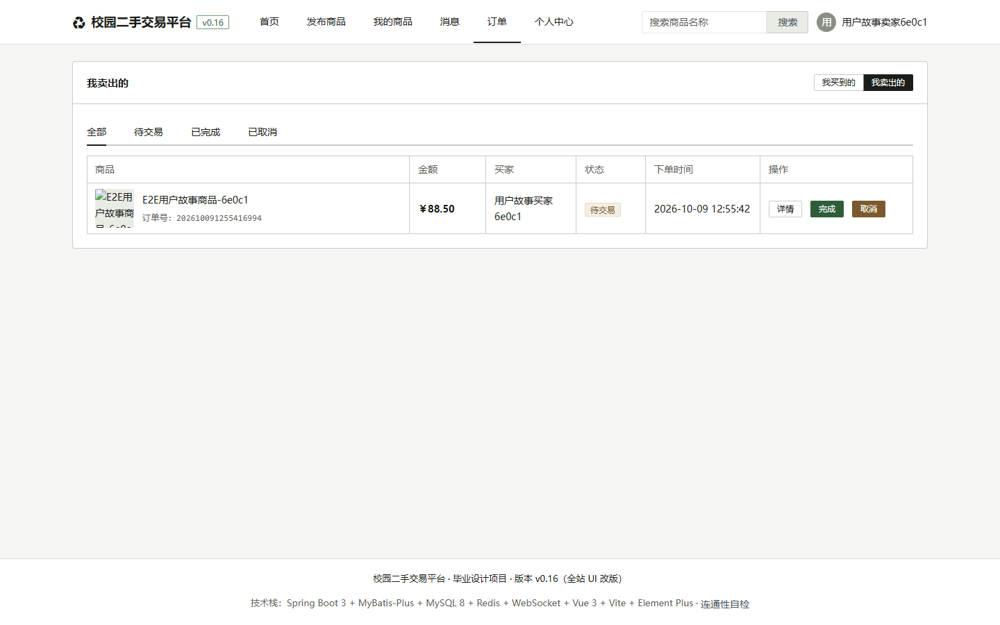

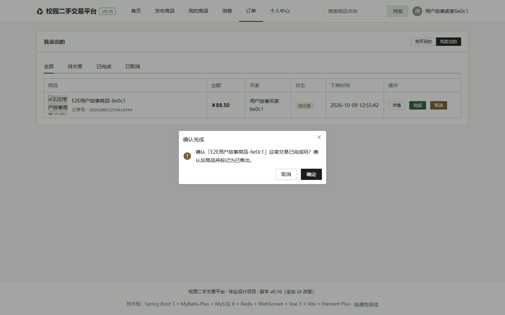

#### US-RECO-01　首页个性化推荐

**验收标准**：AC1 猜你喜欢存在　　**结论**：✅ 通过

- AC1 首页推荐模块 存在 ✓

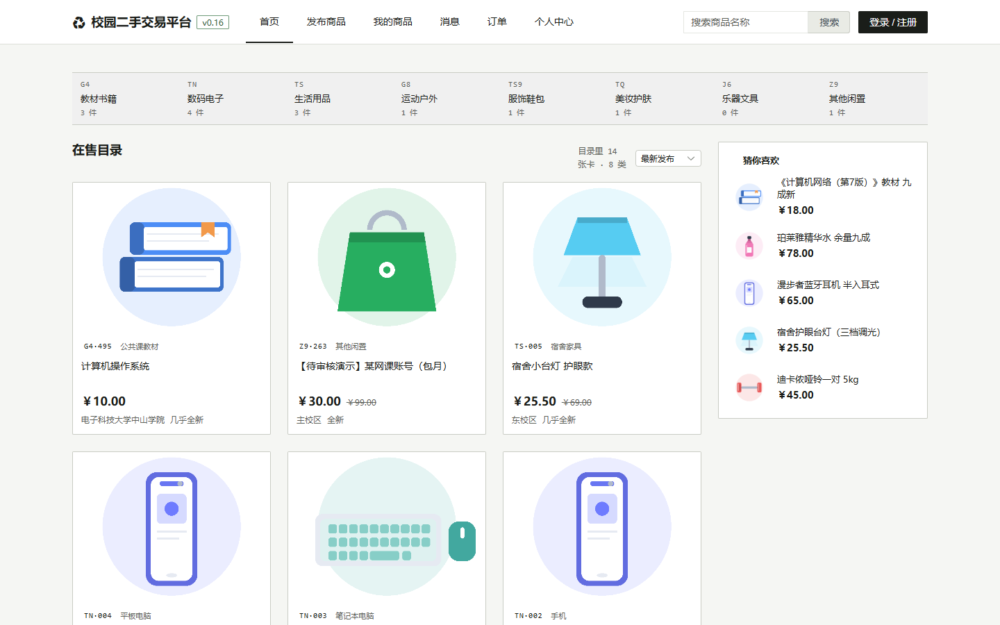

#### US-ADMIN-04　管理后台数据看板

**验收标准**：AC1 看板渲染正常　　**结论**：✅ 通过

- AC1 管理后台数据看板 渲染正常 ✓

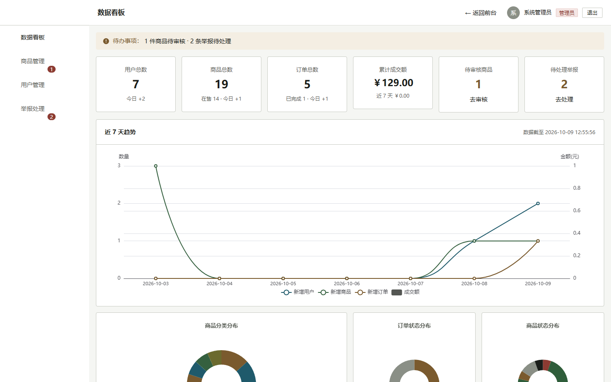

#### US-QUALITY-01　权限与越权防护

**验收标准**：AC2 普通用户访问后台被拦截　　**结论**：✅ 通过

- AC2 普通用户访问后台 → 实际渲染：首页（守卫已重定向 ✓）
- AC（对照）管理员访问后台 → 实际渲染：数据看板 ✓

#### US-QUALITY-05　窄屏可用（390px）

**验收标准**：AC1 无横向溢出　　**结论**：✅ 通过

- AC1 390px 下 scrollWidth=390、innerWidth=390，横向溢出 0px

#### US-SEARCH-01　关键词搜索商品

**验收标准**：AC1 搜到结果 / AC2 空状态　　**结论**：✅ 通过

- AC1 搜索「教材」→ http://127.0.0.1:8081/search?keyword=%E6%95%99%E6%9D%90，结果区有内容 ✓
- AC2 无结果 → 空状态 ✓

## 三、33 条用户故事覆盖矩阵

| 用户故事 | 名称 | 验证方式 | 相关缺陷 |
| --- | --- | --- | --- |
| US-USER-01 | 注册账号 | **本报告（浏览器）** | — |
| US-USER-02 | 登录与登录态保持 | **本报告（浏览器）** | — |
| US-USER-03 | 完善资料与上传头像 | E2E 套件 1.3 | BUG-06 |
| US-GOODS-01 | 发布商品 | **本报告（浏览器）+ E2E 1.4/1.4b** | — |
| US-GOODS-02 | 分类与编号展示 | 单元测试 + E2E 1.5b | BUG-16-01 |
| US-GOODS-03 | 上架与下架自己的商品 | E2E 权限越权 2.2 | BUG-01 |
| US-GOODS-04 | 查看商品详情 | **本报告（浏览器）** | BUG-02 |
| US-ADMIN-01 | 管理员审核商品 | 后台 E2E（e2e-v013-admin.py） | — |
| US-ADMIN-02 | 强制下架违规商品 | 后台 E2E | — |
| US-ADMIN-03 | 用户启用/禁用 | 后台 E2E | — |
| US-ADMIN-04 | 数据看板 | **本报告（浏览器）+ 后台 E2E** | — |
| US-SEARCH-01 | 关键词搜索商品 | **本报告（浏览器）** | BUG-03 |
| US-SEARCH-02 | 按分类筛选 | E2E 1.5 | — |
| US-SEARCH-03 | 只在售可见（数据隔离） | E2E 越权 2.4 + 部署验证 D24 | BUG-01 |
| US-FAV-01 | 收藏与取消收藏 | **本报告（浏览器）+ E2E 1.6 + 异常 4.4** | BUG-04 |
| US-FAV-02 | 查看我的收藏 | **本报告（浏览器）** | — |
| US-CHAT-01 | 私聊卖家 | **本报告（浏览器）+ E2E 1.7** | — |
| US-CHAT-02 | 消息已读回执 | **本报告（浏览器）+ E2E 1.7c~e** | BUG-16-02 |
| US-CHAT-03 | 会话列表与未读数 | **本报告（浏览器）** | — |
| US-ORDER-01 | 买家下单（防一物多卖） | **本报告（浏览器）+ E2E 1.8 + 异常 4.5** | — |
| US-ORDER-02 | 买卖双方订单视图 | **本报告（浏览器）+ E2E 1.9** | — |
| US-ORDER-03 | 确认交易完成 | **本报告（浏览器）+ E2E 1.10** | — |
| US-ORDER-04 | 取消订单并释放商品 | E2E 1.11 | — |
| US-RECO-01 | 首页个性化推荐 | **本报告（浏览器）+ E2E 1.5** | — |
| US-RECO-02 | 详情页相似商品 | E2E 1.5b | — |
| US-RECO-03 | 举报违规商品 | 后台 E2E + 部署验证 D27 | — |
| US-QUALITY-01 | 接口权限与越权防护 | **本报告（浏览器）+ E2E 越权 6 条** | BUG-01、BUG-02 |
| US-QUALITY-02 | 页面三态完备 | check-states.py（CI）+ 部署验证 D3~D5 | BUG-16-05 |
| US-QUALITY-03 | 界面视觉一致（设计令牌） | check-tokens.py（CI，阈值 0） | — |
| US-QUALITY-04 | 可访问性与对比度 | ui-a11y.py + check-states.py（CI） | BUG-16-04 |
| US-QUALITY-05 | 窄屏可用（390px） | **本报告（浏览器）** | — |
| US-QUALITY-06 | 缓存与限流 | 部署验证 D12/D17/D18 + 压测脚本 | — |
| US-QUALITY-07 | 缺陷可追溯与质量不退化 | ci.yml（棘轮门禁）+ defect-log.md | 全部 12 条 |

> 其中加粗的 **13 条**由本报告以「AI 驱动真实浏览器逐条操作 + 截图」执行；其余场景由三套自动化测试覆盖（端到端 31 条、部署验证 28 条、单元测试 76 条），详见 [v0.16 测试报告](test-report-v0.16.md) 与 [缺陷跟踪表](defect-log.md)。

## 四、本次执行中发现并修正的断言问题（方法论）

| # | 一开始的断言方式 | 为什么不可靠 | 正确做法 |
| --- | --- | --- | --- |
| 1 | 用 `innerText` 判断 placeholder 文案 | placeholder 不属于 innerText，会把"页面正常"误判为"被拦截" | 用 `get_by_placeholder(...).count()` |
| 2 | 路由跳转前读取 `page.url` | 跳转是异步的，会把"已拦截"误判为"未拦截"，前后两次读到的值还可能不一致 | 等跳转完成后读，且只读一次 |
| 3 | 只查找 `.el-form-item__error` 错误文案 | 注册页校验触发后是 **is-error 红框**、不渲染文案，会把"已触发校验"误判为"未触发" | 断言状态类 `.el-form-item.is-error` |

**结论：断言要看真实渲染状态，不能只看 URL 或单一 DOM 属性。**

---

*报告由脚本自动生成于 2026-10-09 12:56:16；重新生成：`python tools/story-browser-report.py`。*